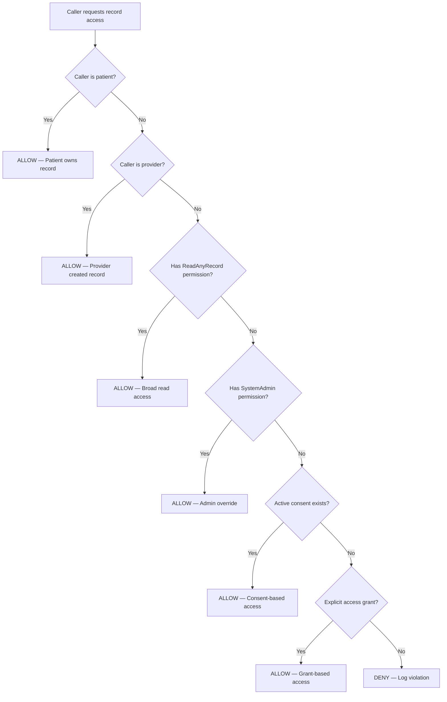

# Vision Records Contract — Architectural Deep-Dive

## Overview

The `vision_records` contract is the central clinical data management module in the RetinaX protocol. It provides a patient-controlled, privacy-preserving system for storing, sharing, and auditing vision health records on the Stellar/Soroban blockchain. The contract enforces granular access control, supports emergency break-glass procedures, and maintains a complete audit trail of all record interactions.

---

## 1. Design Goals

| Goal | Description |
|------|-------------|
| **Patient Sovereignty** | Patients own their data and control who can access it |
| **Privacy by Default** | All record payloads are encrypted; only hashes stored on-chain |
| **Auditability** | Every access (read/write) is logged with caller, timestamp, and result |
| **Emergency Access** | Break-glass mechanism for life-threatening situations |
| **Composability** | Integrates with `access_control`, `key_manager`, `audit`, and `teye_common` libraries |
| **Gas Efficiency** | Batch operations, TTL management, and optimized storage patterns |

---

## 2. Module Architecture

```mermaid
flowchart TB
    subgraph External["External Dependencies"]
        AC[access_control]
        KM[key_manager]
        AUD[audit]
        COMMON[teye_common]
    end

    subgraph VR["vision_records Contract"]
        LIB[lib.rs — Main Contract]
        RBAC[rbac.rs — Role-Based Access]
        CONSENT[consent_management.rs — Consent Grants]
        EMERG[emergency.rs — Break-Glass]
        EXAM[examination.rs — Eye Exam Data]
        RX[prescription.rs — Prescriptions]
        PROV[provider.rs — Provider Verification]
        PAT[patient_profile.rs — Patient Demographics]
        AUDIT[audit.rs — Access Audit Log]
        CB[circuit_breaker.rs — Pause/Guard]
        RL[rate_limit.rs — Rate Limiting]
        ERR[errors.rs — Error Handling]
        EVT[events.rs — Event Publishing]
        VAL[validation.rs — Input Validation]
    end

    LIB --> RBAC
    LIB --> CONSENT
    LIB --> EMERG
    LIB --> EXAM
    LIB --> RX
    LIB --> PROV
    LIB --> PAT
    LIB --> AUDIT
    LIB --> CB
    LIB --> RL
    LIB --> ERR
    LIB --> EVT
    LIB --> VAL

    LIB --> AC
    LIB --> KM
    LIB --> AUD
    LIB --> COMMON
```



---

## 3. Core Data Structures

### 3.1 VisionRecord

The primary on-chain record structure. Only the encrypted hash of clinical data is stored on-chain; the actual payload resides off-chain (IPFS/encrypted storage).

```rust
pub struct VisionRecord {
    pub id: u64,                    // Auto-incremented unique ID
    pub patient: Address,           // Patient's Stellar address
    pub provider: Address,          // Creating provider's address
    pub record_type: RecordType,    // Examination, Prescription, Diagnosis, etc.
    pub data_hash: String,          // Encrypted hash of clinical payload
    pub key_version: Option<String>,// Encryption key version used
    pub created_at: u64,            // Ledger timestamp of creation
    pub updated_at: u64,            // Ledger timestamp of last update
}
```

### 3.2 AccessGrant

Represents a time-bounded access grant from a patient to a grantee.

```rust
pub struct AccessGrant {
    pub patient: Address,
    pub grantee: Address,
    pub level: AccessLevel,     // None, Read, Write, Full, Admin
    pub granted_at: u64,
    pub expires_at: u64,
}
```

### 3.3 ConsentGrant

Patient consent for specific data-sharing purposes.

```rust
pub struct ConsentGrant {
    pub patient: Address,
    pub grantee: Address,
    pub consent_type: ConsentType,  // Treatment, Sharing, Research, Emergency, Billing
    pub granted_at: u64,
    pub expires_at: u64,
    pub revoked: bool,
}
```

### 3.4 EmergencyAccess

Break-glass access grant for emergency situations.

```rust
pub struct EmergencyAccess {
    pub id: u64,
    pub patient: Address,
    pub requester: Address,
    pub condition: EmergencyCondition,  // LifeThreatening, Unconscious, etc.
    pub attestation: String,            // Free-text attestation
    pub granted_at: u64,
    pub expires_at: u64,
    pub status: EmergencyStatus,        // Active, Expired, Revoked
    pub notified_contacts: Vec<Address>,
}
```

---

## 4. Access Control Model

The contract implements a multi-layered access control system:

### 4.1 Permission Hierarchy

```
SystemAdmin (5) ── Full contract control, user management, config
    │
ManageAccess (3) ── Grant/revoke access, manage consent
    │
WriteRecord (2) ── Create and update vision records
    │
ReadAnyRecord (1) ── Read any patient's records
    │
None (0) ── No permissions
```

### 4.2 Unified Permission Resolution

The `has_permission_unified` function provides a pluggable permission system:

1. If an external `access_control` contract is configured, it delegates to that contract
2. Otherwise, it falls back to the local RBAC module

```rust
pub fn has_permission_unified(env: &Env, user: &Address, permission: &Permission) -> bool {
    if let Some(ac_addr) = Self::get_access_control_config(env) {
        let client = AccessControlContractClient::new(env, &ac_addr);
        client.has_permission(user, &ac_perm)
    } else {
        rbac::has_permission(env, user, permission)
    }
}
```

### 4.3 Access Check Flow



---

## 5. Storage Architecture

### 5.1 Storage Key Patterns

| Key Pattern | Type | Purpose |
|-------------|------|---------|
| `(RECORD, id)` | Persistent | Vision record by ID |
| `(PAT_REC, patient)` | Persistent | Patient's record ID list |
| `(ACCESS, patient, grantee)` | Persistent | Access grants |
| `(REC_ACC, record_id, grantee)` | Persistent | Record-level access grants |
| `(CONSENT, patient, grantee)` | Persistent | Consent grants |
| `(USER, address)` | Persistent | User registration data |
| `(EMRG_ACC, id)` | Persistent | Emergency access grants |
| `(EMRG_PAT, patient, id)` | Persistent | Emergency access by patient |
| `ADMIN` | Instance | Contract admin address |
| `PEND_ADM` | Instance | Pending admin transfer |
| `INIT` | Instance | Initialization flag |
| `REC_CTR` | Instance | Record ID counter |
| `RATE_CFG` | Instance | Rate limit configuration |
| `ENC_CUR` | Instance | Current encryption key version |
| `ENC_KEY, version` | Persistent | Encryption key by version |
| `KEY_MGR` | Instance | Key manager contract address |

### 5.2 TTL Management

All persistent storage keys have their TTL extended to ensure data availability:

- **TTL Threshold**: 5,184,000 ledgers (~30 days at 5s/ledger)
- **TTL Extend To**: 10,368,000 ledgers (~60 days)

---

## 6. Encryption Architecture

The contract supports two encryption modes:

### 6.1 Local Encryption (Default)

- Master key stored on-chain under `(ENC_KEY, version)`
- Current version tracked in `ENC_CUR` instance key
- Uses `teye_common::KeyManager` for AES encryption/decryption
- Records store the encrypted hash; decryption happens on read for authorized callers

### 6.2 External Key Manager

- Configured via `set_key_manager` (requires `ContractAdmin` tier)
- Per-record key derivation via `key_manager` contract
- Supports key versioning and rotation
- Used in batch operations for gas efficiency

---

## 7. Cross-Contract Integration

### 7.1 Access Control Contract

When configured, the `access_control` micro-contract handles permission evaluation:

```rust
// In has_permission_unified:
let client = AccessControlContractClient::new(env, &ac_addr);
client.has_permission(user, &ac_perm)
```

### 7.2 Key Manager Contract

Provides per-record key derivation for enhanced security:

```rust
let client = KeyManagerContractClient::new(env, &manager);
let derived = client.derive_record_key(&key_id, &record_id);
```

### 7.3 Audit Contract

All access attempts (successful and denied) are logged:

```rust
let audit_entry = audit::create_audit_entry(
    &env, caller, patient, Some(record_id),
    AccessAction::Read, AccessResult::Success, None,
);
audit::add_audit_entry(&env, &audit_entry);
```

### 7.4 Teye Common Library

Provides shared utilities:
- `ReentrancyGuard` — Reentrancy protection
- `concurrency` — OCC version tracking and conflict resolution
- `lineage` — Provenance DAG for record lineage tracking
- `multisig` — Multi-signature admin operations
- `admin_tiers` — Tiered admin permissions
- `risk_engine` — Risk-based authentication
- `progressive_auth` — Step-up authentication
- `session` — Session management
- `whitelist` — Caller whitelisting

---

## 8. Rate Limiting

The contract implements per-address rate limiting:

```rust
fn enforce_rate_limit(env: &Env, caller: &Address) -> Result<(), ContractError> {
    let cfg: Option<(u64, u64)> = env.storage().instance().get(&RATE_CFG);
    // ... window-based rate limiting logic
}
```

- Configured via `set_rate_limit_config` (requires `ContractAdmin` tier + multisig/progressive auth)
- Sliding window algorithm
- Returns `ContractError::RateLimitExceeded` when limit is hit

---

## 9. Circuit Breaker

The contract supports emergency pausing via the `circuit_breaker` module:

- **Global pause**: Halts all operations
- **Function-level pause**: Halts specific functions (e.g., `ADD_REC`, `GRT_ACC`)
- Checked at the start of each protected function

---

## 10. Admin Transfer

Two-step admin transfer process:

1. **Propose**: Current admin calls `propose_admin(new_admin)`
2. **Accept**: New admin calls `accept_admin()` to complete transfer
3. **Cancel**: Current admin can call `cancel_admin_transfer()` to abort

---

## 11. Batch Operations

### 11.1 Batch Record Creation (`add_records`)

- Validates provider permission once for the entire batch
- Atomically creates all records
- Returns vector of created record IDs
- More gas-efficient than individual `add_record` calls

### 11.2 Batch Access Granting (`grant_access_batch`)

- Patient authorizes once for multiple grantees
- All grants expire at the same time
- Emits batch event for off-chain indexing

---

## 12. Event Publishing

All state-changing operations emit events for off-chain indexing:

| Event | Trigger |
|-------|---------|
| `RecordAdded` | New record created |
| `BatchRecordsAdded` | Batch record creation |
| `AccessGranted` | Access grant created |
| `RecordAccessGranted` | Record-level access granted |
| `ConsentGranted` | Consent granted |
| `ConsentRevoked` | Consent revoked |
| `UserRegistered` | New user registered |
| `AdminTransferProposed` | Admin transfer initiated |
| `AdminTransferAccepted` | Admin transfer completed |
| `ExaminationAdded` | Eye examination data added |
| `AccessViolation` | Unauthorized access attempt |
| `AuditLogEntry` | Access audit record |
| `Error` | Contract error with context |

---

## 13. Error Handling

The contract uses a structured error system with:

- **46 distinct error codes** (`ContractError` enum)
- **Error categories**: Validation, Authorization, NotFound, StateConflict, Storage, Transient, System
- **Severity levels**: Low, Medium, High, Critical
- **Error context**: Includes user, resource ID, timestamp, retryability
- **Error log**: On-chain error log (last 100 entries) for debugging

---

## 14. Security Considerations

| Threat | Mitigation |
|--------|-----------|
| Reentrancy | `ReentrancyGuard` on state-changing functions |
| Front-running | Commit-reveal pattern for admin operations |
| Permission escalation | Unified permission check with delegation limits |
| Rate limiting abuse | Per-address sliding window rate limits |
| Emergency access abuse | Time-limited, audited, with notified contacts |
| Key compromise | Key versioning and rotation support |
| Contract pause | Circuit breaker with granular scope |

---

## 15. Gas Optimization Strategies

1. **Batch operations** — Amortize permission checks across multiple records
2. **TTL management** — Extend TTL only when needed
3. **Storage key design** — Minimal key size using `symbol_short!`
4. **Instance vs Persistent** — Instance storage for frequently accessed config
5. **Lazy decryption** — Only decrypt for authorized callers on read

---

## 16. Testing Strategy

- **Unit tests**: Per-module tests in `src/test_*.rs` files
- **Property tests**: Proptest-based property testing in `tests/property/`
- **Emergency tests**: Dedicated emergency access tests in `tests/emrgency.rs`
- **Integration tests**: Cross-contract integration scenarios

---

## 17. Deployment

```bash
# Build WASM
cargo build -p vision_records --target wasm32-unknown-unknown --release

# Deploy (example with soroban CLI)
soroban contract deploy \
  --wasm target/wasm32-unknown-unknown/release/vision_records.wasm \
  --source <ADMIN_SECRET> \
  --network testnet

# Initialize
soroban contract invoke \
  --id <CONTRACT_ID> \
  --source <ADMIN_SECRET> \
  --network testnet \
  -- initialize \
  --admin <ADMIN_ADDRESS>
```

---

## 17. Future Enhancements

- [ ] Meta-transaction support for gasless operations
- [ ] Zero-knowledge proof integration for anonymous access verification
- [ ] Cross-chain record anchoring via `cross_chain` contract
- [ ] Automated key rotation scheduling
- [ ] Enhanced analytics integration for access pattern monitoring
